# Proiect MSD - Belgradestra Dungeon(RPG Game)

Belgradestra Dungeon, un joc RPG developat de echipa formată din:

- Buca Mihnea-Vicentiu (Grupa 252)
- Dragoș Ciobanu (Grupa 251)
- Ricardo-Dumitru Petrovici (Grupa 251)

Pentru mai multe detalii despre progresul proiectului, backlog și user stories vom folosi: [Trello Board](https://trello.com/invite/b/pEjZSd6s/ATTIddc018db9c046f6478649aff84e14d034EE12CEC/proiect-mds).

## Documentatie

## Keyboard

Controalele sunt sugestive vom folsi in mare: &larr; &rarr; &uarr; &darr; pentru a naviga meinurile

<kbd>Enter</kbd> pentru a aplica actiuni asupra meniurilor

<kbd>Esc</kbd> pentru a iesi din meniuri/actiuni

<kbd>Esc</kbd> pentru a iesi din meniuri/actiuni

-------------------------

## User Stories

-------------------------

https://trello.com/b/pEjZSd6s/proiect-mds

## Backlog

-------------------------

https://trello.com/b/pEjZSd6s/proiect-mds

## Diagrame

-------------------------

### Class Diagram

### Class Diagram

### ChatGPT
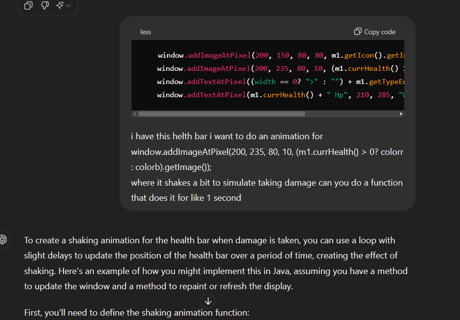
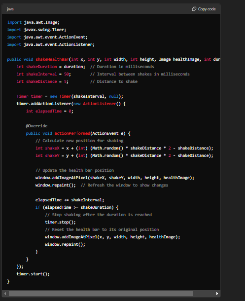

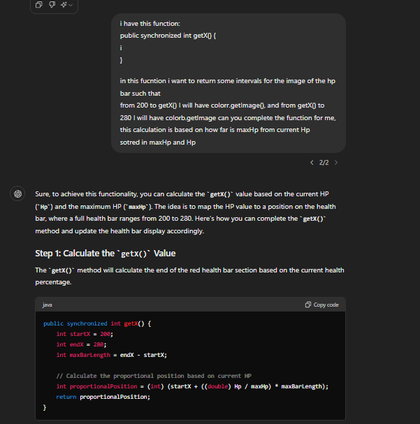
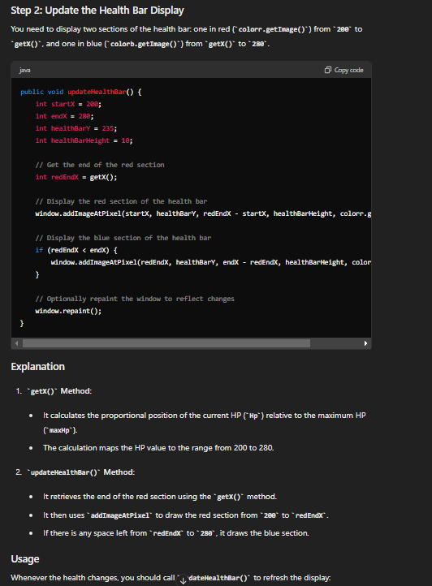

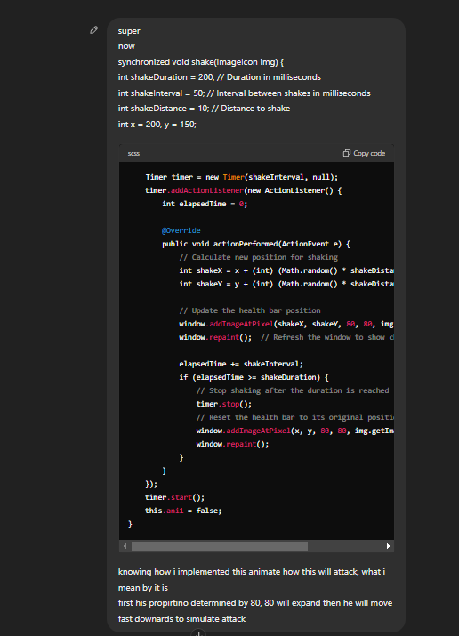
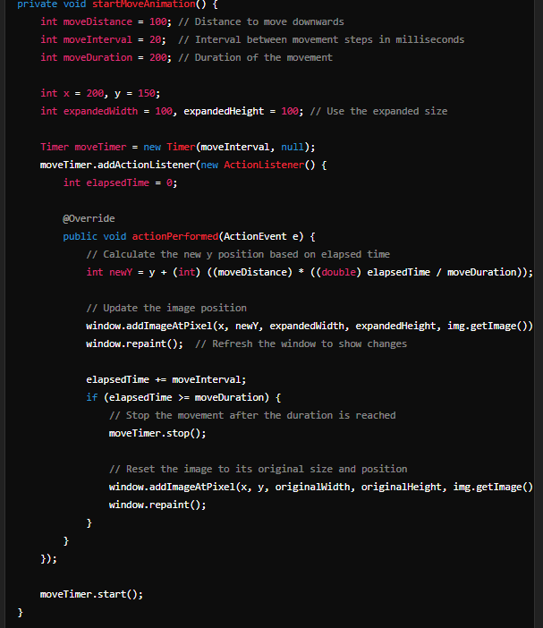
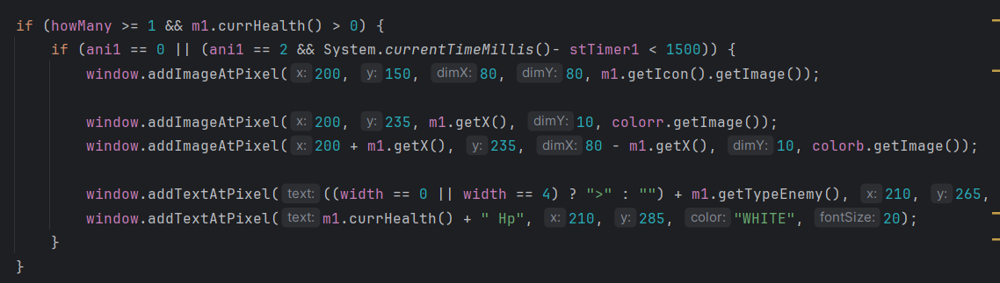
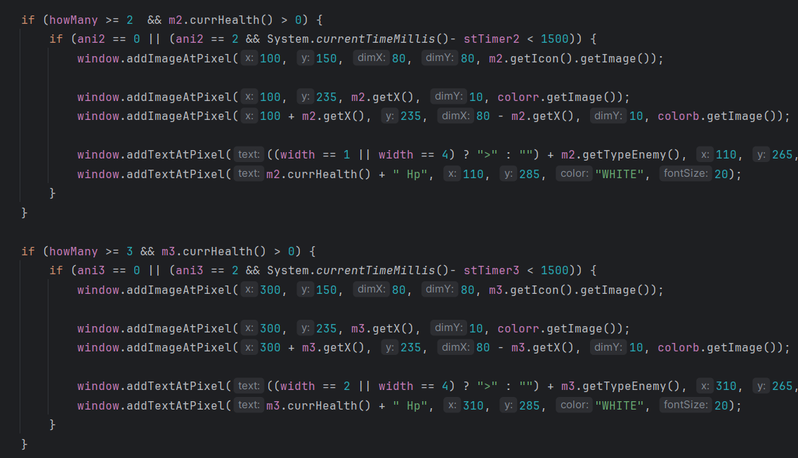
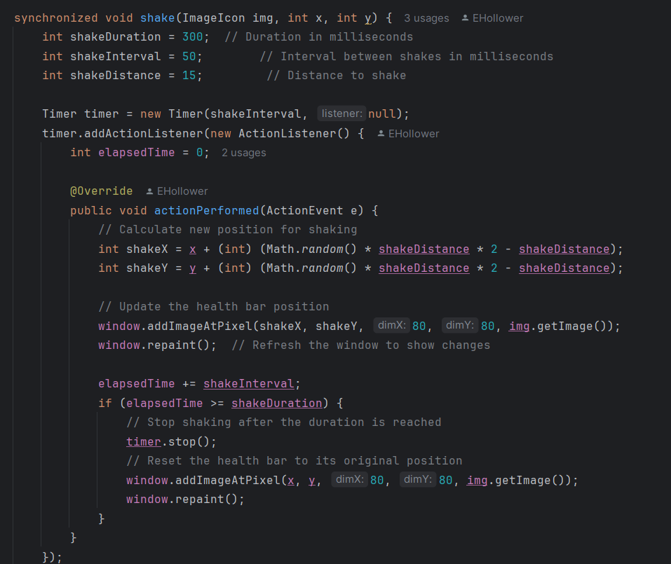
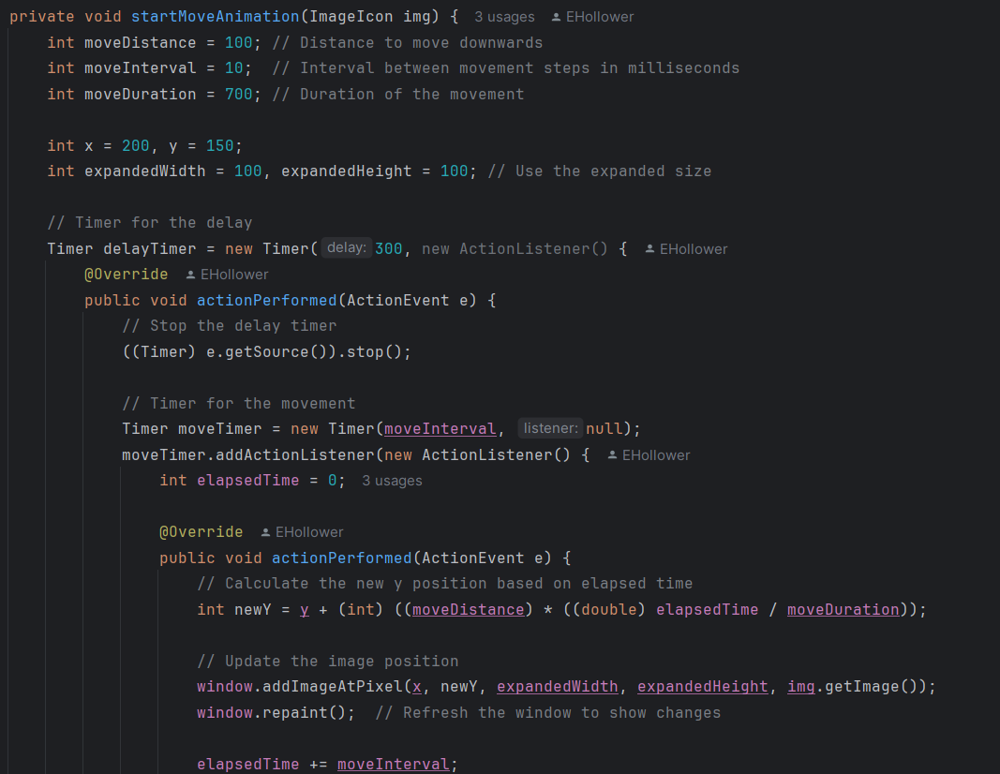
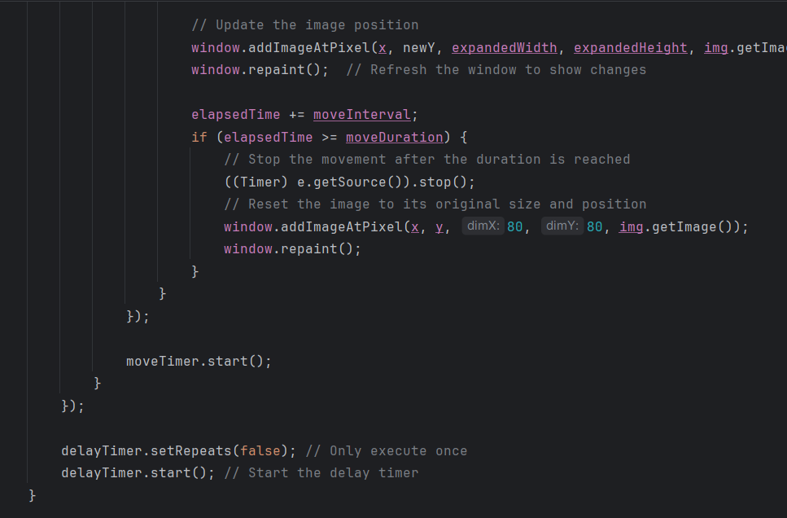

## Demo

-------------------------

## Setup

-------------------------

<pre>git clone --recursive https://github.com/dragosc1/MDS-Proiect</pre>
