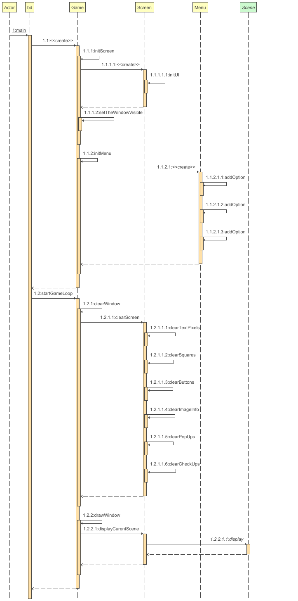
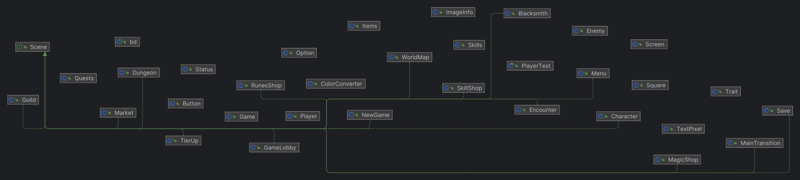

## Documentatie

## Keyboard

Controalele sunt sugestive vom folsi in mare: &larr; &rarr; &uarr; &darr; pentru a naviga meinurile

<kbd>Enter</kbd> pentru a aplica actiuni asupra meniurilor

<kbd>Esc</kbd> pentru a iesi din meniuri/actiuni

<kbd>Esc</kbd> pentru a iesi din meniuri/actiuni

-------------------------

## User Stories

-------------------------

https://trello.com/b/pEjZSd6s/proiect-mds

## Backlog

-------------------------

https://trello.com/b/pEjZSd6s/proiect-mds

## Diagrame

-------------------------

### Class Diagram

### Class Diagram

